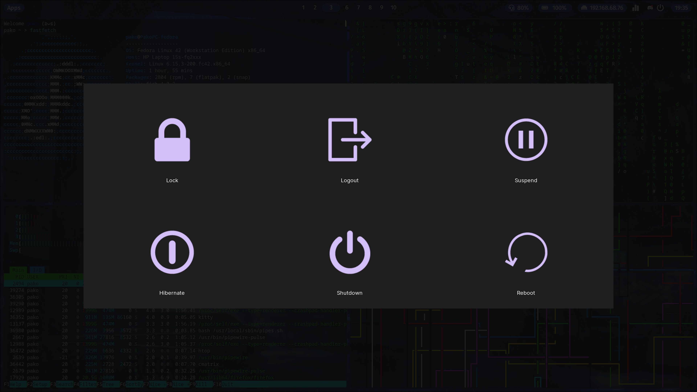

<div align="center">


# ~/.dotfiles


</div>

Welcome to my dotfiles repository! 🖥️

This is my personal Linux setup that I've been crafting and refining over time. It's a hyprland-based configuration focused on productivity and aesthetics, with custom scripts and tweaks that make my daily workflow smooth and enjoyable.

Feel free to explore, steal ideas, or suggest improvements. Nothing here is set in stone! 🚀

## Table of Contents

- [📸 Screenshots](#-screenshots)
- [⚙️ Configs](#️-configs)
- [📝 TODO](#-todo)
- [⌨️ Shortcuts](#️-shortcuts)
- [🚀 Installation](#-installation)
- [🎨 Customization](#-customization)
- [🤝 Contributing](#-contributing)
- [📄 License](#-license)
- [🙏 Credits](#-credits)

## 📸 Screenshots

<div align="center">

<table>
  <tr>
    <td></td>
    <td></td>
  </tr>
  <tr>
    <td></td>
    <td></td>
  </tr>
</table>

</div>

## ⚙️ Configs

- **OS**: Fedora Linux 42 (Workstation Edition) x86_64
- **WM (Window Manager)**: hyprland
- **File Manager**: nautilus + nnn
- **Browser**: firefox/chromium
- **Terminal**: kitty
- **Shell**: fish
- **Editor**: neovim/vscode
- **Top Bar**: waybar
- **Launcher**: rofi
- **Notification Daemon**: dunst
- **Logout Menu**: wlogout

## 📝 TODO

### ✅ Completed
- [x] Screenshot management scripts with notifications
- [x] Color picker integration
- [x] Clipboard history with rofi integration
- [x] Custom waybar restart script
- [x] Hyprland keybindings configuration
- [x] Multi-monitor setup configuration

### 🚧 In Progress
- [ ] Automated installation script
- [ ] More hyprland animations
- [ ] Custom fish functions documentation
- [ ] rofi themes collection
- [ ] More waybar themes

## ⌨️ Shortcuts

### Window Management
- `super + Q`: open terminal (kitty)
- `super + C`: close active window
- `super + E`: open file manager (nautilus)
- `super + V`: toggle floating window
- `super + R`: toggle app launcher (rofi)
- `super + SPACE`: toggle app launcher (rofi)
- `super + P`: pseudo tile (dwindle)
- `super + J`: toggle split (dwindle)

### Focus Movement
- `super + ←/→/↑/↓`: move focus with arrow keys

### Workspaces
- `super + 1-9,0`: switch to workspace 1-10
- `super + shift + 1-9,0`: move active window to workspace 1-10
- `super + S`: toggle special workspace (magic)
- `super + shift + S`: move to special workspace (magic)
- `super + mouse_scroll`: scroll through workspaces

### Screenshots
- `Print`: screenshot (area selection)
- `shift + Print`: full screenshot

### System Controls
- `super + M`: power menu (wlogout)
- `super + Y`: restart waybar
- `super + backslash`: color picker
- `super + shift + V`: clipboard history (cliphist)

### Media Keys
- `XF86AudioRaiseVolume`: volume up (+5%)
- `XF86AudioLowerVolume`: volume down (-5%)
- `XF86AudioMute`: toggle mute
- `XF86MonBrightnessUp`: brightness up (+10%)
- `XF86MonBrightnessDown`: brightness down (-10%)

### Mouse Actions
- `super + LMB drag`: move window
- `super + RMB drag`: resize window

## 🚀 Installation

1. **Clone the repository**:
   ```bash
   git clone https://github.com/pako/dotfiles ~/.config/dotfiles
   cd ~/.config/dotfiles
   ```

2. **Backup your existing configs** (important!):
   ```bash
   mkdir -p ~/.config/backup
   cp -r ~/.config/{hypr,waybar,kitty,fish,dunst,rofi} ~/.config/backup/
   ```

3. **Setup configurations** (choose one method):
   
   **Option A - Symlinks (recommended):**
   ```bash
   ln -sf ~/.config/dotfiles/.config/* ~/.config/
   ```
   
   **Option B - Direct copy:**
   ```bash
   cp -r ~/.config/dotfiles/.config/* ~/.config/
   ```

4. **Install dependencies**:
- [hyprland](https://github.com/hyprwm/Hyprland)
- [waybar](https://github.com/Alexays/Waybar)
- [kitty](https://github.com/kovidgoyal/kitty)
- [fish shell](https://github.com/fish-shell/fish-shell)
- [dunst](https://github.com/dunst-project/dunst)
- [rofi-wayland](https://github.com/lbonn/rofi)
- [wlogout](https://github.com/ArtsyMacaw/wlogout)
- [grim](https://github.com/emersion/grim)
- [slurp](https://github.com/emersion/slurp)
- [wl-clipboard](https://github.com/bugaevc/wl-clipboard)
- [nerd fonts](https://github.com/ryanoasis/nerd-fonts)

## 🎨 Customization

These dotfiles are crafted to match my personal workflow, but the beauty of Linux is in making it your own! 

### 🛠️ Key customization areas:
- **hyprland**: Experiment with different animations, window rules, or create your own keybindings
- **waybar**: Add custom modules, change the layout, or create multiple bar configurations
- **kitty**: Play with color schemes, font combinations, or transparency levels
- **fish**: Write custom functions, create aliases that match your workflow
- **rofi**: Design your own themes, add custom modi, or integrate with your scripts

### 💡 Pro tips:
- Start small - change one thing at a time
- Keep backups of configurations that work for you
- Don't be afraid to break things - that's how you learn!

## 🤝 Contributing

Hey there! While these are my personal configs, I love when people get involved. Here's how you can contribute:

### 🐛 Found a bug?
- Open an issue and describe what's broken
- Include your system info and what you were trying to do

### 💡 Got a cool idea?
- Suggest new features or improvements
- Share interesting scripts or configurations you've made

### 🚀 Want to contribute code?
1. Fork the repository
2. Create a feature branch (`git checkout -b cool-new-feature`)
3. Make your changes and test them
4. Submit a pull request with a clear description

### 📝 Other ways to help:
- Improve documentation
- Share screenshots of your setup using these configs
- Help other users in issues

Remember: every contribution, no matter how small, makes this project better! 🌟

## 📄 License

This project is licensed under the GNU General Public License v3.0 - see the [LICENSE](LICENSE) file for details.

## 🙏 Credits

All configurations and tweaks were created by me, with inspiration from the amazing Linux ricing community.

Special thanks to:
- The hyprland development team
- The dotfiles community on r/unixporn
- Everyone sharing their configs and scripts

---

*Made with ❤️ and lots of ☕*